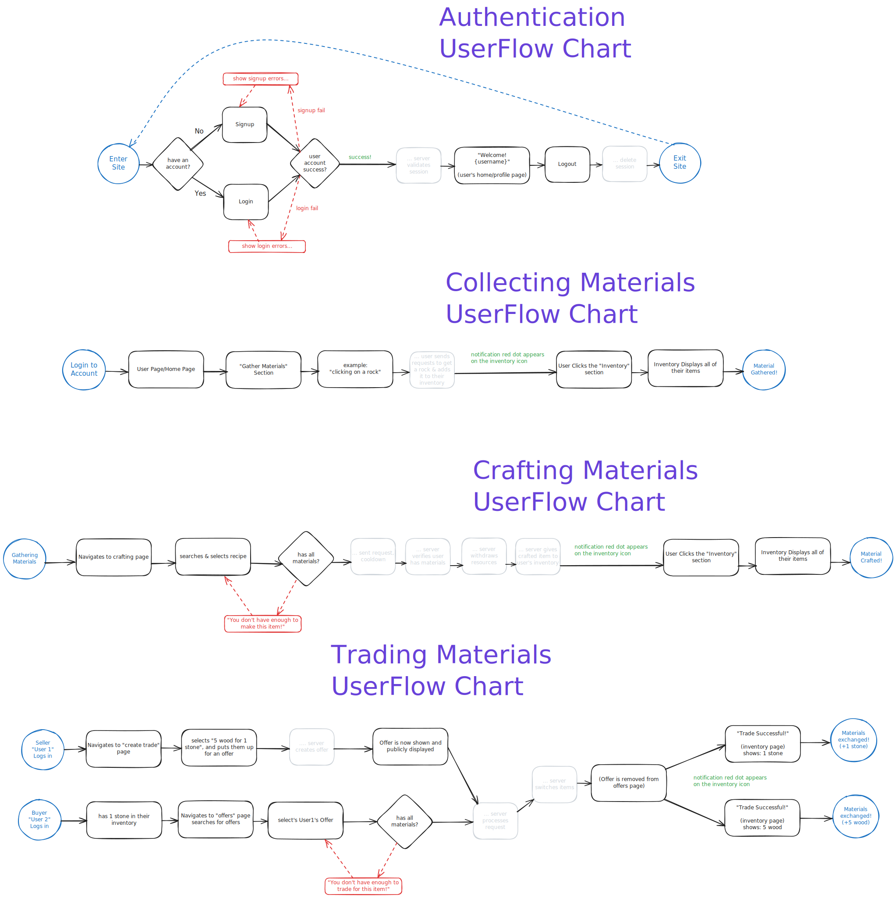

## There's Four Main Systems:

👤 User Session:
- Signup
- if already have account Login
- Welcome! show profile page
- Logout

🌲 Collecting:
- Navigating & Obtaining

🛠️ Crafting:
- Navigating Crafting Menu
- Gathering
- Exchanging Materials

🔁 Trading
- Searching for offers
- or Making an Offer
- Exchanging Materials Between Others

*See the charts!* 📈

  

## 🌍 legend:
- blue circle = start/finish
- rectangle = action/site/generic
- black arrow = path forward
- red dotted arrow = deviation from the regular path/going backwards
- red rectangle = showing erros
- diamond = decision diamond
