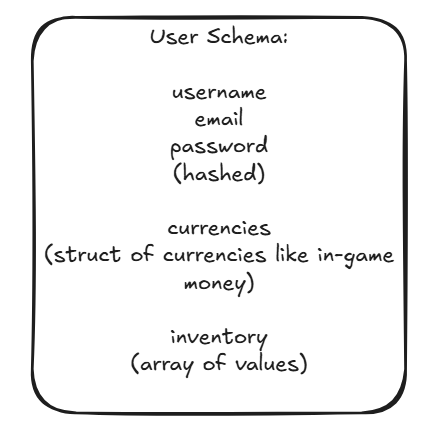

 

# 🛠️ Capstone Project Proposal — Part 2  
📅 **Date:** 7/17/2025  
📁 _(see the Springboard Capstone Project Step 2 for the official outline)_

  
(see the springboard capstone project step2 for the outline on how to plan this out!)

*This proposal should be a 1-2 page document that answers the following questions:*

## ⚙️ 1. What tech stack will you use for your final project?

<u> The **MERN stack** Mongoose's doc database is very flexible and allows for easily storing complex objects Express will help with the routing of the API React to make the site itself with component architecture Node.js for all the unique functionality
Possibly might use Next.js though for Express & React to even further simplify things
Although I'm more used to making the architecture myself with the routes and stuff than Next.js' forced alien naming conventions, so I'm not sure yet

TypeScript will be used to build confidence in the code & I haven't decided on the test framework yet — either Mocha & Chai, Jest, or Supertest or something. I'll have to research that later
</u>

## 🪟 2. Is the front-end UI or the back-end going to be the focus of your project? Or are you going to make an evenly focused full-stack application?

<u> It will be an **evenly focused full-stack application** A user interface communicating with an API hosted elsewhere </u>

## 🕸️ 3. Will this be a website? A mobile app? Something else?

<u> The **Site** will interact with the **Server** </u>

## 🎯 4. What goal will your project be designed to achieve?

<u> The main goal is to **demonstrate my understanding** and gain more experience Though the project itself will just be a fun **crafting experience** where you forage together materials </u>
## 🧑‍💻 5. What kind of users will visit your app? (What is the demographic of your users?)
<u> The main target audience would be **gamers** Ones that play online web game apps like **slither.io** or **cookie clicker** Though it's possible it could easily be **ported to mobile** </u>

## 📦 6. What data do you plan on using? How are you planning on collecting your data?
<u> I'll have **inventory data**, **tons of materials**, and **users** I'll generate all of it through test data and crafting logic — no external API needed </u>
      
## In brief, outline your approach to creating your project (knowing that you may not know everything in advance and that these details might change later). Answer questions like the ones below, but feel free to add more information 

● What does your database schema look like?

There'd be a User schema, with a username, email, password, and inventory
And I think that's it
Most of the item data is stored in the inventory

● What kinds of issues might you run into with your API? This is especially important if you are creating your own API, web scraping produces notoriously messy data. 

My data is just items being created, so I won't have to worry about getting data to seed it from online
I'll just seed it with test accounts to test everything out. Though unfortunately since its a custom API I'm making myself, I'll have to rigorously check and verify all the logic works with unit tests. There's probably going to be tons of bugs early on.

There's also: security issues, like spamming requests, attempting invalid requests, validating requests if they make sense or not, race conditions, & not destroying user data on accident.

● Is there any sensitive information you need to secure? 

We'll need to bcrypt hash the password

● What functionality will your app include?

Login, Logout, Signup, Trade, Obtain Resource, Craft
& Set Profile Picture

● What will the user flow look like? 

Signup/login, go to the home page, then trade with others or gather resources, Logout

● What features make your site more than a CRUD app? What are your stretch goals? 

It does create, read, update, and delete information
But ontop of that there's also more complex features like crafting & trading and sorting the item list
      
*filling the chart questions next...*

## ❓ The Whats:
🖥️ Stack Focus: Full-Stack
🪟 Type: Website
🎯 Goal: Demonstrate Skills, Craft Materials
🧑 Users: Web-Gamers
💾 Data: UserInfo and InventoryInfo

## 🏠 Design Database Schema:
I have chosen a non-relation database (mongo_db) because it handles storing complex structs very well and flexibly, such as various inventory items, and tons of player & item properties.

## 📊 Here's a chart of the entire database schema:

  

(the only database object is the Users, as items will be handled as regular JSON objects in the users' inventory array)

## 🔍 Source Your Data:
I'll create my own API/routes for this project, to handle the crafting system. I'll supply it with initial test seed data for testing.

## 🌊 User Flows:
Signup/Login -> Home/Navigate -> Gather Materials/Craft Materials -> Exchange Materials -> Logout

## 💽 Set up backend database & env values:
-requires a mongodb database URI
-bcrypt hash secret keyword
-JWT auth most likely
-URL/port number

## 🪟 Set up Frontend:
-React Client Site
-use Axios to send calls

## 🎖️ User Auth:
-JWT
-save session timestamp in db
-login session data middleware

## 📋 Labeled Tasks:

- TASK, WHERE, DIFFICULTY, ? IS OPTIONAL
- starting up the project, medium, Fullstack
- mongoose schemas, medium, Backend/Logic
- crafting system, medium, Backend/Logic
- trading/selling, hard, Backend/Logic
- routes system, easy, Server
- login logout signup, easy-medium, Server
- theming, hard, Frontend CSS & Backend Logic
- seed data, medium-hard, Backend
- setting up test packages and test mode, hard, Fullstack
- unit tests, medium-hard, Backend

## ⭐ BONUS FEATURES:

- leaderboard
- built app version
- real time updating (might have to do extra research on that)
- seasons that influence the mechanics of the game over irl time

