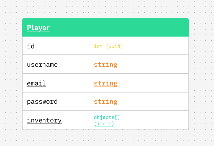

# 💽 Project's Schema:

This schema is for Mongoose/MongoDB.
I figured only 1 object was really nessecary, since most of the complex logic just has to do with the items in the user's inventory.

(designed in figma using a template)

  

